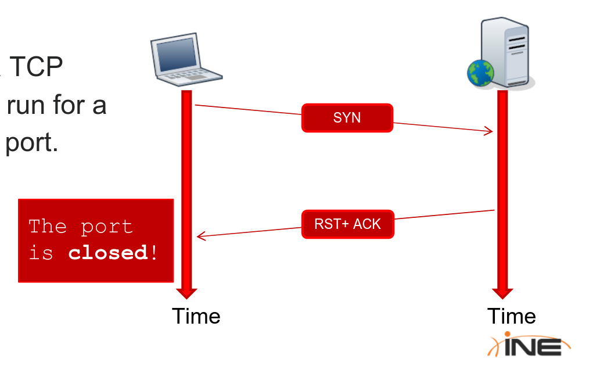

# Mapping a Network

## 2.2.2 Ping Sweeping

* Ping Sweeping tools automatically perform ping operation to every host in a subnet or IP range

## 2.2.2.1 Fping

* **`Fping`** is a linux tool that can be used for ping sweeping
	* `fping -a -g IPRANGE`
		* `-a` forces the tool to show only alive hosts
		* `-g` tells the tool that we want to perform ping sweep instead of standard ping
* **Example**:
`fping -a -g 10.54.12.0/24` (CIDR notation)
`fping -a -g 10.54.12.0 10.54.12.255`

## 2.2.2.2 Nmap Ping Scan

* You can perform a ping scan by using the `-sn` command line switch
* **Examples**:
	`nmap -sn 200.200.00.00/16`
	`nmap -sn 200.200.123.1-12`
	`nmap -sn 172.16.12.*`
	`nmap -sn 200.200.12-13.*`
	
* You can save your host list to a file and use `-iL` to invoke it in Nmap
* **Example**:
	`nmap -sn -iL hosts.txt`
	
## 2.2.3 OS Fingerprinting

* OS Fingerprinting is the process of determining the operating system used by the host on a network
* To fingerprint an operating system, you have to send network requests to the host then analyze responses, because different OSs have differences in the network stack implementation
* During a penetration test, you will have to perfom this recon step on every network node indluding: (Routers, Firewalls, Hosts, Servers, Printers...)
* Offline OS fingerprinting can be done using [p0f](https://lcamtuf.coredump.cx/p0f3/)
* To Perform OS fingerprinting using `nmap`, you have to use `-O` 	option and specify your target
* You can also add `-Pn` to skip the ping scan if you already know if the targets are alive

***
***

# Port Scanning

## 2.3.1.2 TCP Connect Scan

* If the scanner receives a **RST** (reset) pakcet, then the port is closed
* If the scanner can complete the 3-way hanshake, then the port is open. After connecting, the scanner sends a **RST** packet to the target host to abruptly close the connection

## 2.3.1.3 TCP SYN Scan

* **TCP SYN** scan were invented to be stealthy by desing
* During a **TCP SYN** scan, the scanner does not perform a full handshake it just sends a **TCP SYN** packet and if it gets an **ACK** packet, then the port is open, if it gets **RST** packet then the port is closed
* A SYN Scan cannot be detected by looking at daemons logs, as there were no real connection

## 2.3.6 Discovering Network with Port Scanning

* It's not uncommon to come across a server that does not respond to pings but has many TCP or UDP ports open (firewall is blocking ping)
* Whith nmap, using `-Pn` switch forces a scan on such a server by skipping ping scanning and treating it as alive
* Open ports are signs of the following services running:

## 2.3.8 Masscan

* [Masscan](https://github.com/robertdavidgraham/masscan) is a tool worth looking at