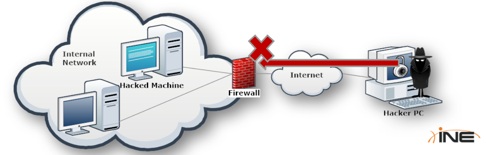

# Malware

## 5.1 Malware

* Malware classification is based on the behavior of the softeware rather than the malicious features it provide:
	* Virus
	* Trojan Horses
	* Rootkit
	* Bootkit
	* Backdoor
	* Adware
	* Spyware
	* Greyware
	* Dialer
	* Key-Logger
	* Botnet
	* Ransomeware
	* Data-Stealing Malware
	* Worm

## 5.1.1 Virus

* A computer virus is program that spreads from computer to computer without any direct action or authorization by the owners of the infected machines
* They usually copy themselves to special secitons of the hard disk, inside legitimate programs or documents, they then run every time an infected program or file is opened

## 5.1.2 Trojan Horses

* A Trojan horse is a malware that comes embedded in a seemingly harmless file such as an executable, an MS office document or maybe a PDF file
* The most common Trojan horses used by a penetration tester are backdoors to get a shell on the infected system

## 5.1.3 Backdoor

* Backdoors are software made by two components: server and client
* **NetBus** and **SubSeven** are old school very famous backdoors

## 5.1.3.1 Firewalls vs Backdoors

* If the sysadmin configure the network firewall to block connections from the internet to internal machines, the attacker then will not be able to connect to the backdoor

* Moreover, connection tries from internet to an internal machine will raise some alarms
* A well-done backdoor would use any means to make the traffic look legitimate; the easiest way to achieve this is by using a **Connect-back Backdoor**

## 5.1.3.2 Firewalls vs Connect-back Backdoors

* Instead of having the victim machine as a server and listening to the client's command, it acts as a client and connects back to the penetration tester's machine
* The attacker's machine would listen on a port that is known to be commonly allowed on most of the firewalls such as port 80 (the web server port)

## 5.1.4 Rootkit

* A rootkit is a malware which is designed to hide itself from users and the antivirus program in order to completely subvert the OS functioning. It lets the attacker maintain priviliged access to the victim machine without being noticed

## 5.1.5 Bootkit

- Bootkits are rootkits which circumvent OS protection mechanisms by executing during the bootstrap phase
- They start before the operating system, so they get complete control over the machine and the OS

## 5.1.6 Adware

- Adware is annoying software that shows ads to computer users

## 5.1.7 Spyware

- Spyware collects information from infected devices such as: the OS installed, visited websites, passwrods...
- The information is sent back to a log collection server controlled by the attacker

## 5.1.8 Greyware

