# Protocols

## 2.1.1 Packets

- Every packet in every protocol has this structure: **Header** | **Payload**
    - The *Header* has a protocol-specific structure
    - Then *Payload* is the actual information (part of an email, part of a file...)

## 2.1.1.1 Example - The IP Header

The IP protocol header is at least 160 bits (20 bytes) long, it includes information that interpret the content of the IP packet

- The first 4 bits identify the IP version. (IPv4,IPv6)
- The 32 bits starting at position 96 represents the source address
- The next 32 bits represents the destination address

## 2.1.3 ISO/OSI

- The **ISO/OSI** model was never implemented, but it is widely used in literature or when talking about IT networks.
- ISO/OSI consists of 7 layers:
    - Application
    - Presentation
    - Session
    - Transport
    - Network
    - Data Link
    - Physical

### 2.1.4 Encapsulation

- **Q:** How do protocols work together if every protocol has a header and a payload? How can a protocol use the one on it's lower layer?
    
    - **A:** The entire upper protocol packet (header+payload) is the payload of the lower one.
        this is called **encapsulation**.
- **TCP/IP** is a real-world implementation of a networking stack and is the protocol stack used on the internet.
    
- **TCP/IP** has 4 layers:
    
    - Application
    - Transport
    - Network
    - Data Link

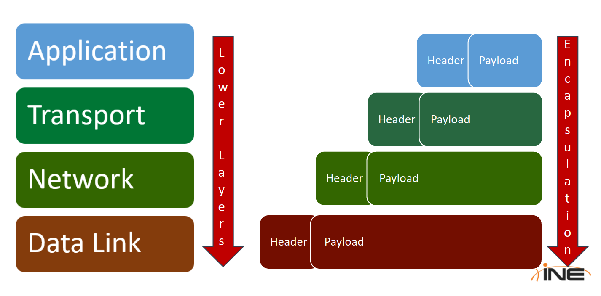

- **Encapsulation** in **TCP/IP:**
    - During encapsulation every protocol adds it's own header to the packet, treating it as a payload
    - This happens to every packet sent by the host.

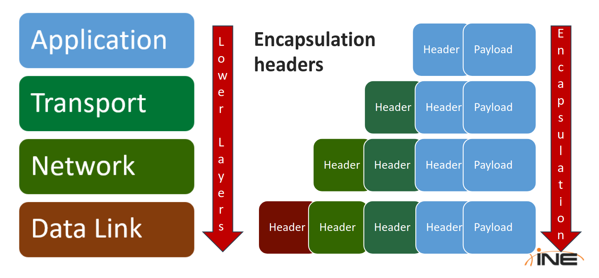

- The receiving host does the same operation in reversed order
- Using this method, the *application* does not need to worry about how the *transport, network* and *link* layers work. It just hands in the packet to the *transport* layer.

* * *

* * *

# Internet Protocol

## 2.2 IP

- The Internet Protocol **(IP)** is the protocol that runs on the internet layer of the Internet protocol suite, also known as **TCP/IP**
- **IP** is in charge of delivering the **datagrams** (IP packets are called **datagrams**) to the hosts involved in a communication

## 2.2.2 Reserved IPv4 addresses

- `0.0.0.0 - 0.255.255.255` represent "this" network
- `127.0.0.0 - 127.255.255.255` represent the local host (e.g, my computer)
- `192.168.0.0 - 192.168.255.255` is reserved for private networks

## 2.2.3 IP/Mask

- To fully identify a host, you need to know it's network. To do that, you need:
    - IP address
    - netmask or subnet mask
- To find the network part you have to perform a **Bitwise *AND* operation** between the netmask and the IP address

## 2.2.3.1 IP/Mask CIDR Example:

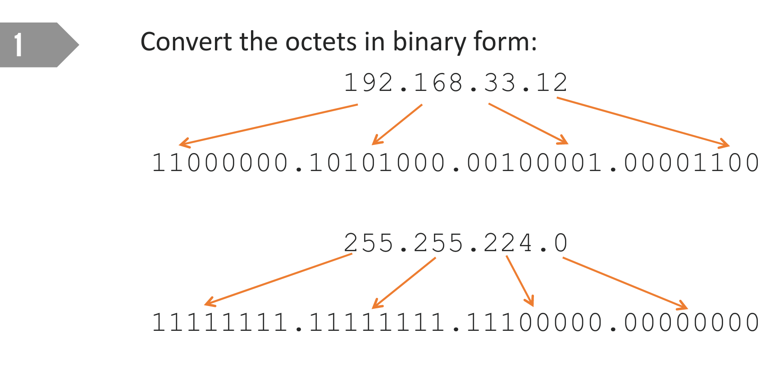 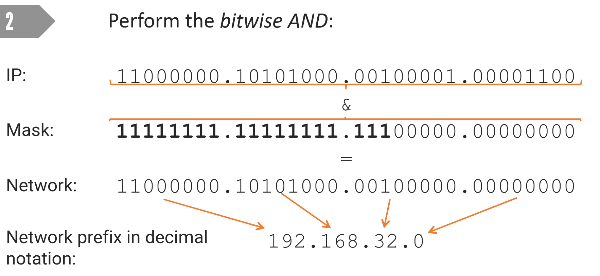

- We can identify the network by the following notation: `192.168.32.0/255.255.224.0`\]
- OR as the netmask is made by 19 consecutive "1" bits: `192.168.32.0/19`
- The latter is the **Classless Inter-Domain Routing (CIDR) notation**

## 2.2.3.2 IP/Mask Host Example

- The address part not covered by the netmask is the **host part** of the IP address. We can find it by performing a bitwise *AND* with the inverse of the netmask.

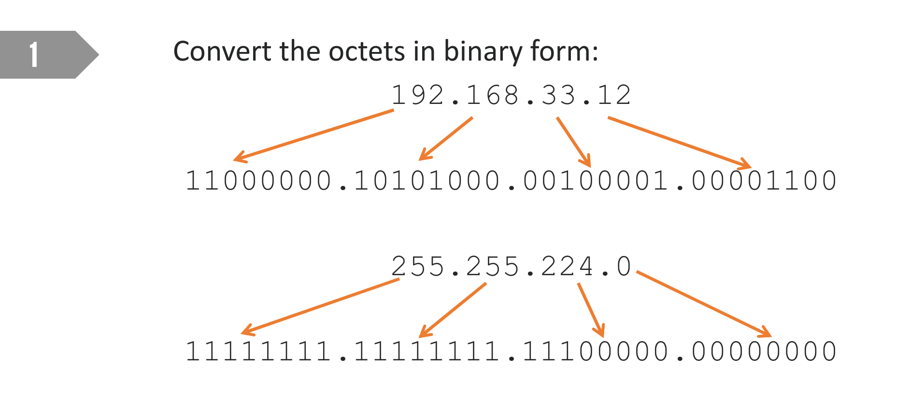 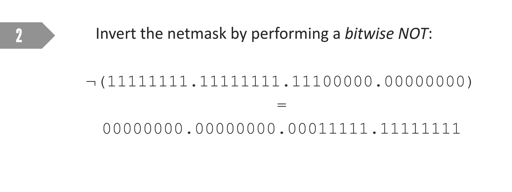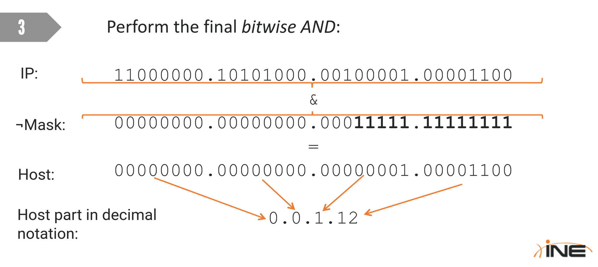

- Moreover, the inverse of the netmask lets you know how many hosts a network can contain
- In the example above, we have 13 bits to represent the hosts, this means that the network can contain 2^13 = 8192 different addresses.

## 2.2.7 IPv6

- An IPv6 cosists of **16-bit hexadecimal numbers** seperated by a **colon (:)**
- Hexadecimal numbers are case insensitive, in case zero occur, they can be skipped.
- IPv6 Examples:
    - `2001:0db8:0020:130F:0000:0000:087C:140B`
    - `2001:0db8:0:160F::850C:140B`
- IPv6 can be presented in forms:
    - Regular form: `1080:0:FF:0:8:800:200C:417A`
    - Compressed form: `FF01:0:0:0:0:0:0:43` becomes `FF01::43` as a result of skipping zeros
    - IPv4-compatible: `0:0:0:0:0:0:13.1.68.3` or `::13.1.68.3` after skipping zeros
- IPv6 also have reserved addresses
    - `::1/128` is a lookback address
    - `::FFFF:0:0/96` are IPv4 mappeed addresses
- The first 64 bits of an IPv6 ends with dedicated 16-bits space (one hex word) that can be used only for specifying a subnet

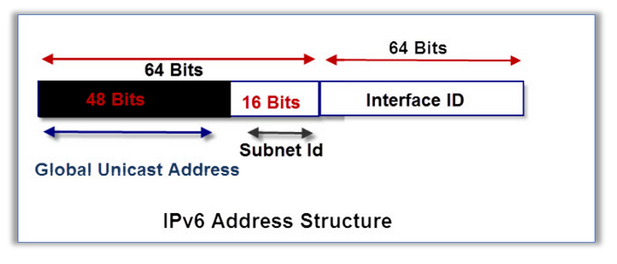

* * *

* * *

# Routing

## 2.3 Routing

- Routing protocols are used to determine the best route to reach a network.
- A router inspects the destination address of every incoming packet and then forwards it through one of its interfaces.
- To choose the right forward interface, the router performs a lookup in the **routing table**, where it finds an IP-to-Interface binding.
- The table can also contain an entry with the default address (0.0.0.0). It is used when the router receives a packet whose destination is an unknown network.

## 2.3.1.1 Routing Table Example

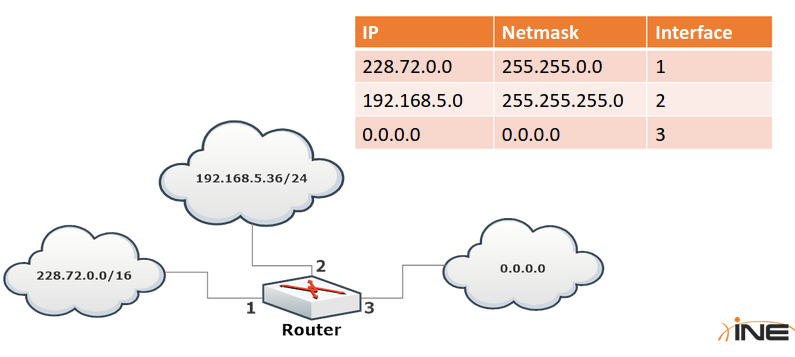 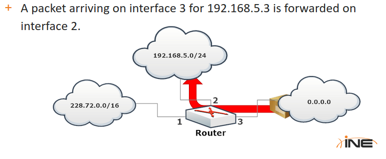

## 2.3.1.2 Default Route Example

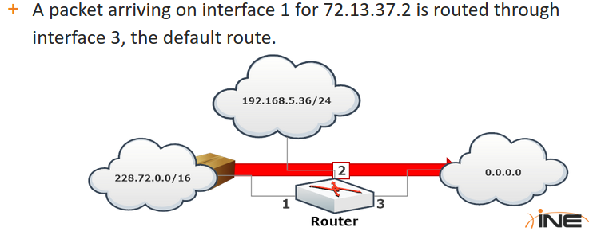

## 2.3.2 Routing Metrics

- During path discovery, routing protocols also assign a metric to each link.
- If two paths have the same number of hops, the fastest route is selected.
- The metric is selected according to the channel's estimated bandwidth and congestion.

## 2.3.2.1 Routing Metrics Example

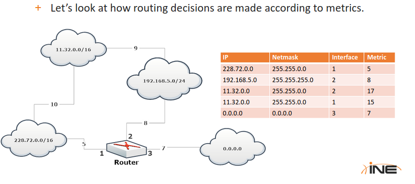 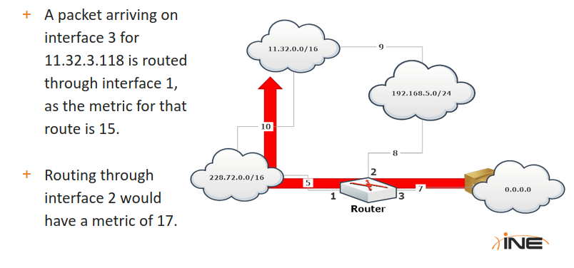

## 2.3.3 Checking the Routing Table

- On **Linux**: `ip route`
- On **Windows**: `route print`
- On **MacOS**: `netstat -r`

* * *

* * *

# Link Layer Devices and Protocols

## 2.4.1 Link Layer Devices

- Hubs and Switches are network devices that forward frames (layer 2 packets) on a local network
- The work with link layer network addresses: **Mac addresses**

## 2.4.2 Mac Addresses

- **IP addresses** are layer 3 (Network layer) addressing scheme used to identify a host in a network
- **Mac addresses** uniquely identify a network card (layer 2)
- **Mac address** == **Physical address**
- **Mac addresses** are 48 bit (6 bytes) long and are expressed in Hexadecimal
    - `00:11:AA:22:EE:FF`
- To discover the Mac address of the network card:
    - **Linux:** `ip addr`
    - **Windows:** `ipconfig /all`
    - **Unix/Linux:** `ifconfig`

## 2.4.3 IP and Mac Addresses

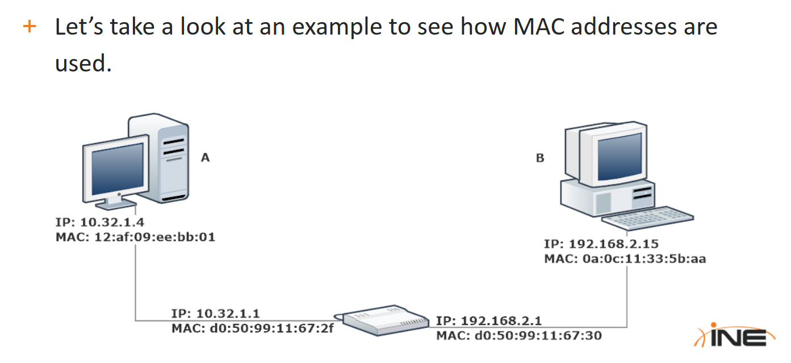

**If workstation A wants to send a packet to workstation B, which IP and Mac address will it use?**

- Workstation A will create a packet with:
    - The destination IP address of workstation B in the IP header of the datagram
    - The destination MAC address of the router in the link layer header of the frame
    - The source IP address of workstation A
    - The source MAC address of workstation A
- The router will then take the packet and forward it to B's network rewriting the packet's Mac addresses:
    - The destination MAC address will be B's
    - The source MAC address will be the router's
- The router will not change the source and destination IP addresses.
- When a device sends a paket:
    - The destination MAC address is the MAC address of the next hop
    - The destination IP address is the address of the destination host, **this is global information that remains the same along the packet trip**
- This method recalls how you send a letter to a friend
    - Home address (IP address)
    - Nearest post office's address (MAC address)
- The **Broadcast MAC address** `FF:FF:FF:FF:FF:FF` is a special mac address
- A frame (the name of the packet at layer 2) with this address is delivered to all the hosts in the local network

## 2.4.5 Switches

- While router work with IP addresses, Switches work with **Mac Addresses**
- They have multiple interfaces, so they need to keep a forwarding table that binds one or more Mac addresses to an interface
- The forwarding table is called **Content Addressable Memory (CAM)** table
- The speed of packet forwarding in switches varies from 10Mbps to 10Gbps (nowdays, 1Gbps is the most common)

## 2.4.5.3 Multi-Switch Example

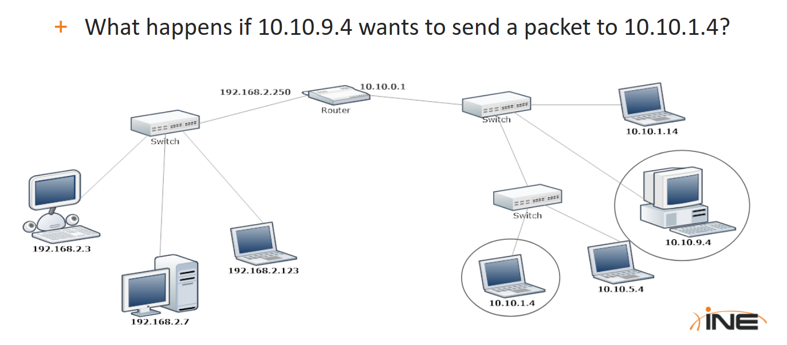 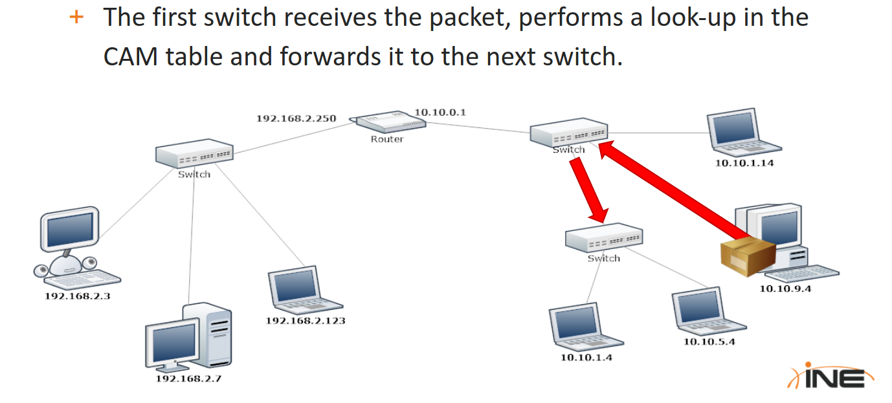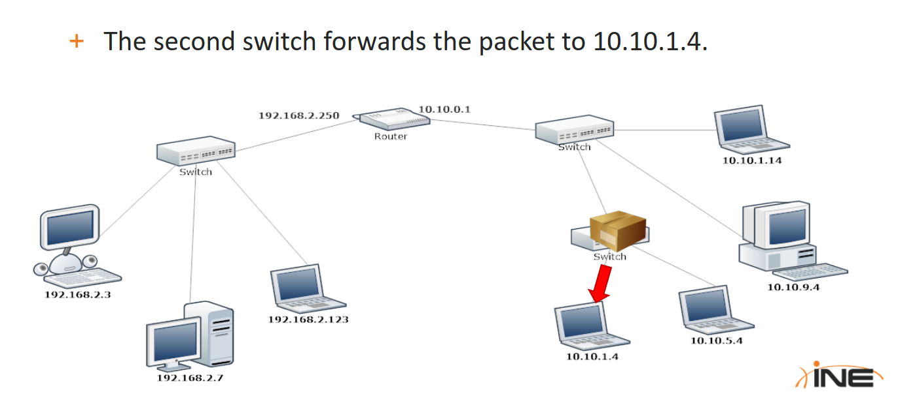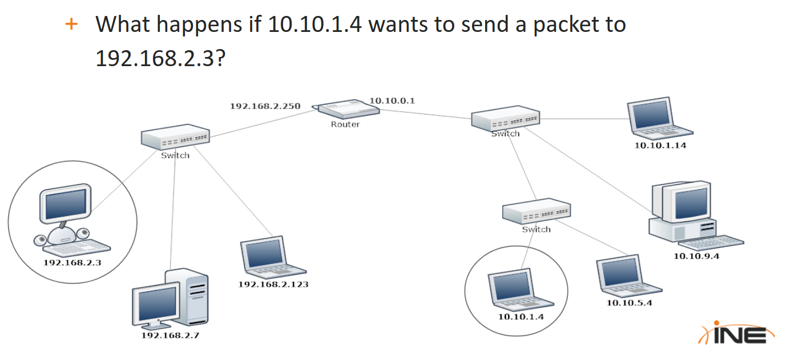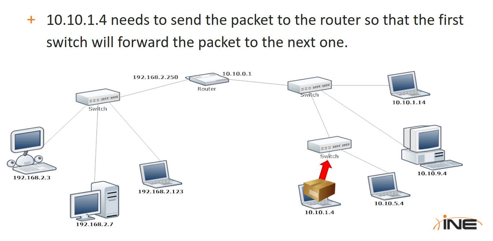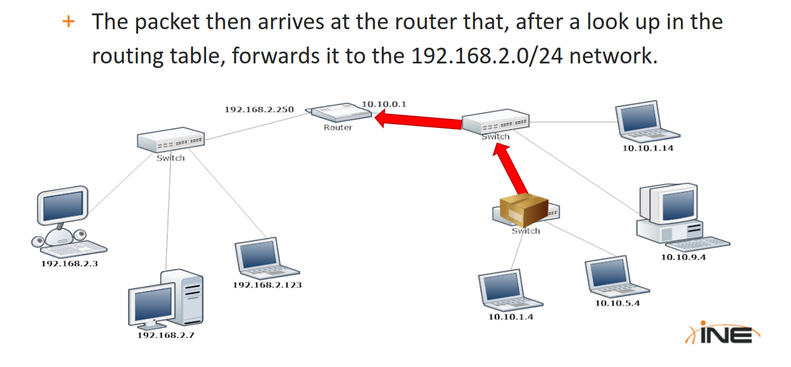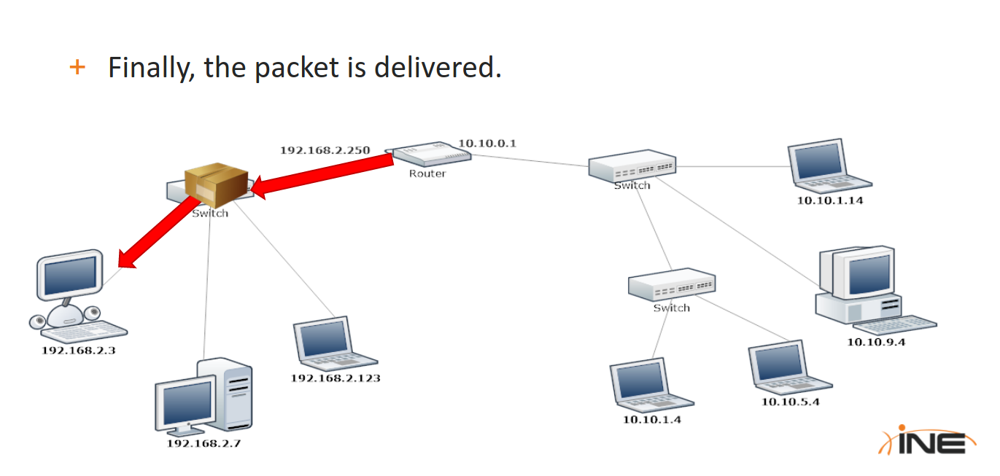

## 2.4.5.5 Forwarding Tables

- The Forwarding table or (CAM table) is stored in the device's RAM and constantly refreshed with new information

- One single host is attached to interface 1 and 3
- Two hosts are attached to interface 2
- There might be multiple hosts on the same interface and interfaces without any host
- The TTL determines how long an entry will stay in the table. The CAM table has a finite size.
- Switches learn new Mac addresses dynamically, inspecting the header of every packet they receive, thus identifying new hosts.

## 2.4.5.6 CAM Table Population

- The source MAC address is compared to the CAM table:
    - if the MAC address is not in the table => switch adds new MAC-interface binding to the table
    - if the MAC-interface binding is already in the table => the TTL gets updated
    - if the MAC is in the table but bount to another interface => the switch updates the table.

## 2.4.6 ARP

- **What happens if the source host knows the IP address, but not the MAC address of the destination host?**
    - This situation occurs on every power up
- The Host needs to know the MAC addresses of the other network nodes, and it can be done by ARP (Address Resolution Protocol)
- When a Host *A* wants to send traffic to another *B* and it onley knows the IP address of *B*:
    - *A* builds an **ARP request** containing the IP address of *B* and `FF:FF:FF:FF:FF:FF` as destination Mac address.The switches will forward the packet to every host.
    - Every host on the network will receive the packet
    - *B* replies with an **ARP reply** telling *A* it's MAC address.

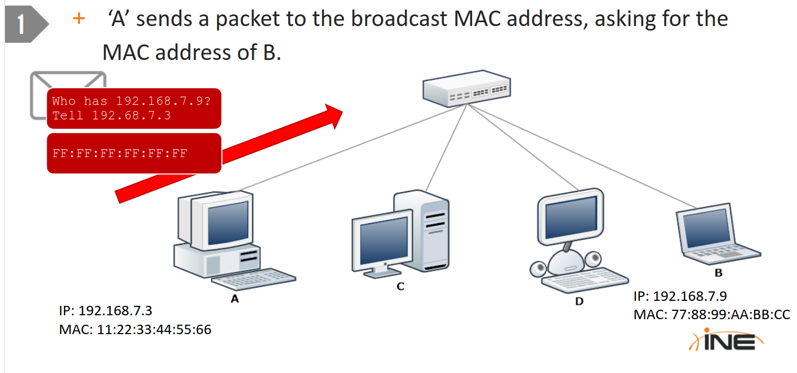 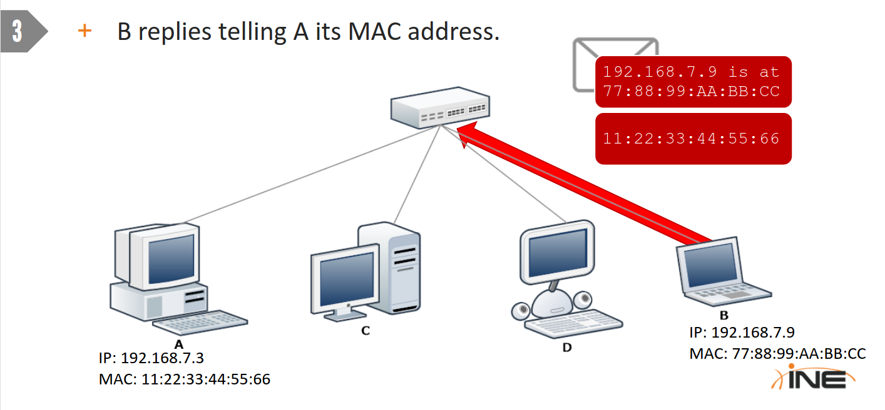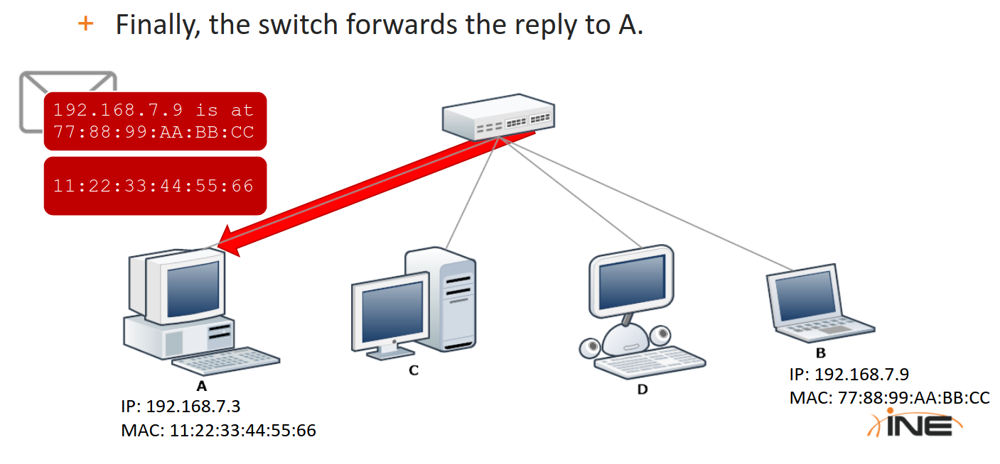

- *"A"* will save the IP - MAC binding in its ARP cache
- ARP cache entrie have TTL too, *A* Host discard the entry at the power off or when the entry's TTL expires
- Checking ARP cache:
    - **Linux**: `ip neighbour`
    - **Linux/Unix**: `arp`
    - **Windows**: `arp -a`

## 2.4.7 Hubs

- Hubs were used before switches, they are simple repeaters that do not perform header check and simply forwards packets by just repeating electric signals.
- The receive electric signals on a port and repeat the same signal on all other ports.

* * *

* * *

# TCP & UDP

## 2.5 TCP and UDP

- The **Transmission Control Protocol** (TCP) and The **User Datagram Protocol** (UDP) are the most Transport protocols used on the internet.
    
- Computer Networks can be **unreliable**, this means that some packets can be lost during their trip because of:
    
    - Network Congestion
    - Temporary loss of connection
    - Other technical issues
- **TCP**:
    
    - Guarantees packet delivery
    - Connection oriented. It must establish a connection before transferring data.
- TCP is the most used transport protocol on the internet, the IP protocol suite is often called **TCP/IP**
    
- Email clients, web browsers, FTP clients are some common applications using TCP
    
- **UDP**:
    
    - Does not guarentee packet delivery
    - connectionless
- UDP is faster than TCP, as it provides a **better throughput** (number of packets/second); and it is used by multimedia applications that can tolorate packet loss but are throughput intensive.
    
- For example, UDP is used by VoIP and video streaming: where you can tolorate a little glitch in the audio or video
    

## 2.5.1 Ports

- When an IP diagram (packet) reaches a host, how can the transport layer know what the destination process is?
- **Ports** are used to identify a single network process on a machine. `<IP>:<PORT>`

## 2.5.2 Well-Known ports

- Ports ranging from 0-1023 are called the well-known ports and are used by servers for most common services
- You should at least remember the most common:

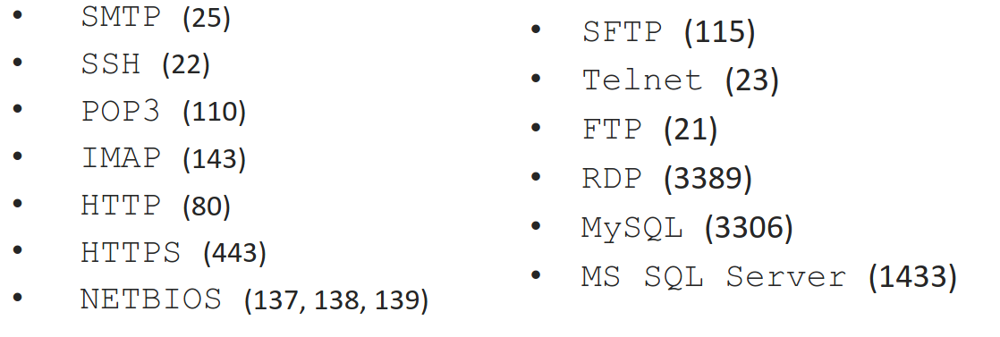

- **Daemon** is a program that runs a service. System administrators can change daemon configuration, changing the port the service listens to for connection. They do that to make services recognition a little bit harder for hackers
- For example, you could find FTP daemon listening on port 4982 or SSH listening on port 8821
- Server and Client applications know which port to use through 2 fields in the TCP and UDP header: The source and Destination ports.

## 2.5.2.1 TCP Header

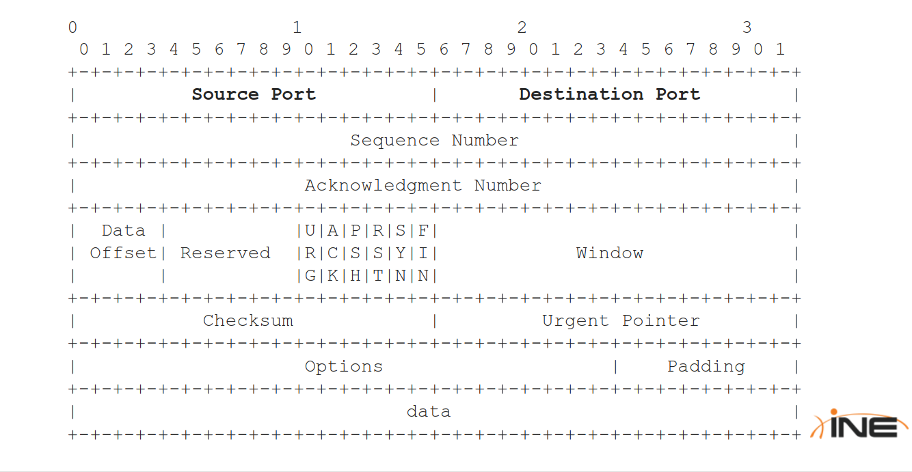

## 2.5.2.2 UDP Header

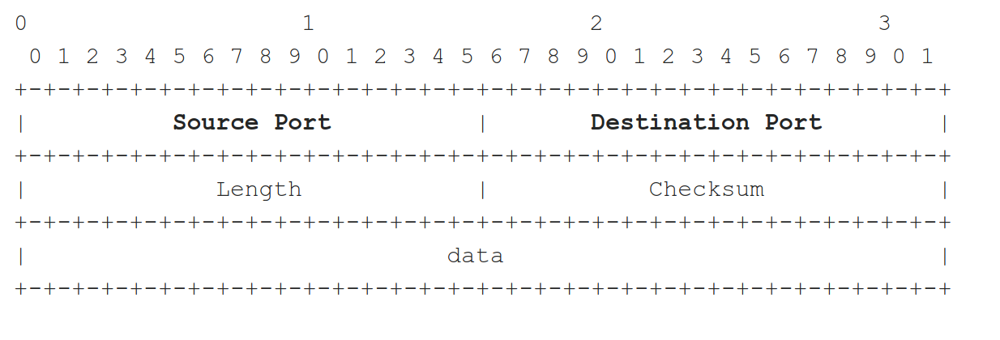

## 2.5.4 Netstat Command

- To check the listening ports and the current (TCP) connections on a host you can use:
    - **Linux:** `netstat -tunp`
    - **Windows:** `netstat -ano`
    - **Unix/Linux:** `netstat -p udp -p tcp` or `lsof -n -i4TCP -i4UDP`

## 2.5.5 TCP Three Way Handshake

- The header fields involved in the handshake are:
    - Sequence number
    - Acknowledgment numbers
    - SYN and ACK flags

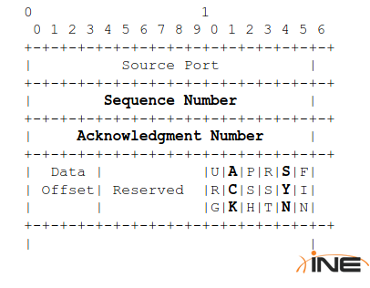

- The steps in the handshake are used to synchronize the sequence and acknowledgment numbers between the client and the server
    1.  The client sends a TCP packet to the server with the SYN flag enabled and a random sequence number
    2.  The server replies by sending a packet with both the SYN and ACK flags set and another random sequence number. The ACK number is always a simple increment of the SYN number sent by the client
    3.  The client completes the synchronization by sending an ACK packet. (note that the client acts like the server when sending ACK packets)

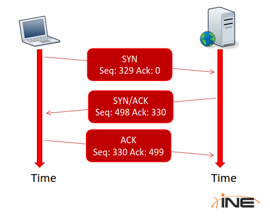

* * *

* * *

# Firewalls and Network Defense

## 2.6.1 Firewalls

- Firewalls are specialized software modules running on a computer or a dedicated network device
- They serve to filter packets coming in and out of a network
- A firewall can work on differnet layers of the OSI model, thus providing different features and protection

## 2.6.2 Packet Filtering Firewalls

- The most basic feature of firewalls is Packet Filtering
- An administrator can create rules which will filter packets according to:
    - Source IP address
    - Destination IP address
    - Source Port
    - Destination Port
    - Protocol
- Packet Filters run on home DSL routers as well as high-end enterprise routers and are the cornerstone of network defense.
- Packet Filters inspects the header of every packet to choose how to treat the packet:
    - **Allow:** allow the packet to pass
    - **Drop:** drops the packet without any diognistic message to the packet source host
    - **Deny:** do not let the packet pass, but notify the source host

## 2.6.2.1 Packet Filtering vs. Application Attacks

- In a company that hosts a web server The firewall will allow all incoming traffic from the internet and directs it to port 80 of the web server
- In the same way, application exploits will pass because the firewall cannot see the difference between normal traffic and a web application exploit
- The firewall can only filter traffic by IP, ports and protocols, any kind of application layer traffic pass even exploits
- An application layer exploit could be XSS, buffer overflow, SQL injection and much much more
- Packet filtering is not enough to stop layer 7 attacks

## 2.6.2.2 Packet Filtering vs. Trojan Horse

- A Typical firewall configuration rule is to let HTTP traffic (TCP.dst =80) pass, but a trojan sending or receiving packets on port 123 will be be unable to connect to the hacker
- If the hacker is smart (usually he is), configures the trojan to connect back to his machine on port 80, the firewall will allow the connection

## 2.6.3 Application level Firewalls

- Application level Firewalls work by checking all the OSI 7 layers
- They inspect the actual contentof the packet and not just the headers, for example:
    - Drop any peer-to-peer application packet
    - Prevents users from visiting a site

## 2.6.4 IDS

- Itrusion Detection Systems (IDS) inspect the application payload trying to detect potential attack

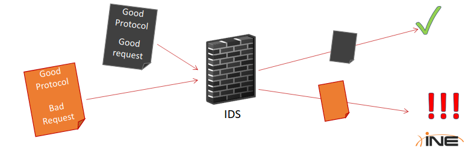

- An IDS is a spesialized software used for detecting ongoin instructions.
- It Checks for attack vectors like **ping sweeps, port scans, SQL injections, buffer overflows** and so on
- IDS can also identify traffic generated by a virus or a worm
- Pretty much every Network threat can be detected by a well-configured IDS
- An IDS detects risky traffic by mean of signatures (there are also false positives)
- IDSs do not substitute firewalls
- IDSs fall into two main categories:
    - Network Intrusion Detection Systems (NIDS)
    - Host Intrusion Detection System (HIDS)

## 2.6.4.1 NIDS

- NIDS inspects network traffic by means of sensors which are usually placed on a router or in a network with a high intrusion risk like DMZ.

## 2.6.4.2 HIDS

- Host IDS sensors monitor application logs, file-system changes and changes to operating system config

## 2.6.5 IPS

- IDSs, unlike firewalls, detect suspicious activities and report them, but the are not blocked
- **Intrusion Prevention System (IPS)** can drop malicious requests when a threat has a risk classification above a pre-defined threshold

## 2.6.6 Spot an Obstacle

- During penetration testing, you might want to identify if a firewall-like mechanism is used in the enviroment
    
- If you suspect presence of firewall, you might want to check for anomalies in TCP three-way handshake
    
- When a firewall is in place, the following behavior may be spotted:
    
    - **TCP SYN** are sent, but there are no **TCP SYN/ACK**
    - **TCP SYN** pakcets are sent but a **TCP RST/ACK** reply is received

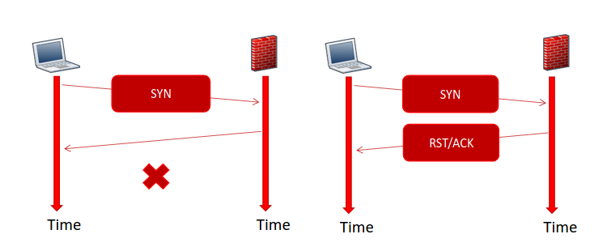

- This thype of observation does not determine whether the detected obstacle is firewall, IDS or any other devices. This just helps you to identify enviromental constraints

## 2.6.7 NAT and Masquerading

- **NAT** and **IP Masquerading** are two techniques used to provide access to network from another network

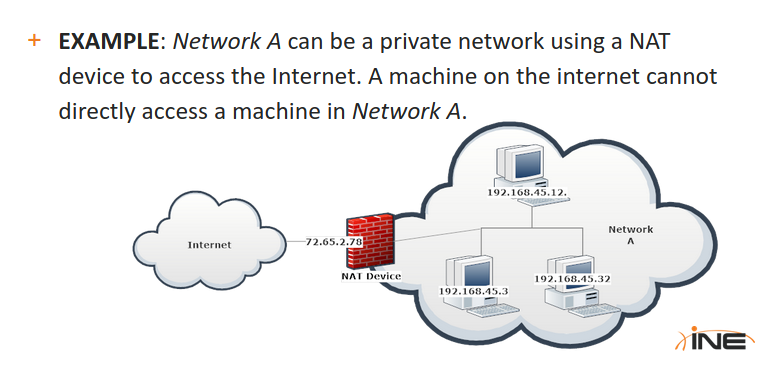

- Every machine inside Network A will use the NAT device as its default gateway, thus routing its internet traffic through it
- The NAT device then rewrites the source IP address of every packet setting it to `72.65.2.70` (in our example), Thus Masquerading the original client's IP address

* * *

* * *

# DNS

- The DNS primarily converts humen-readable names like 0l0v3r1.xyz to IP addresses and is a fundemental support protocol for the internet and computer networks in geneal

## 2.7.1 DNS Structure

- A DNS name such as www.elearnsecurity.com or members.elearnsecurity.com can be broken down into:
    - Top Level Domain (TLD)
    - Domain Part
    - Subdomain part (if applicable)
    - Host Part

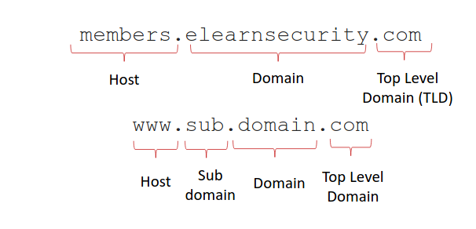

- Name resolution is performed by resolvers, servers that contact the top-level domain (TLD) DNS server and follow the heirarchy of the DNS name to resolve the name of a host
- Resolvers are DNS servers provided by your ISP or publicly available like OpenDNS or Google DNS

## 2.7.2.1 DNS Resolution Algorithm

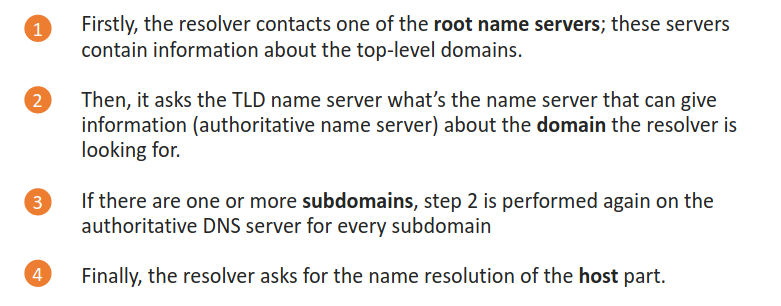

## 2.7.2.2 DNS Resolution Example

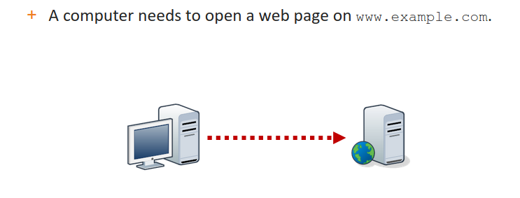 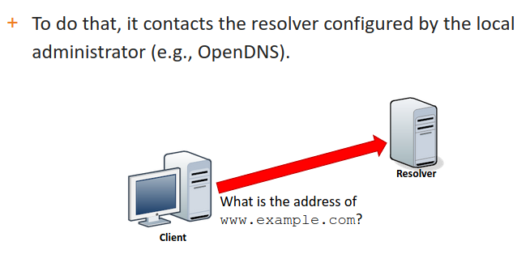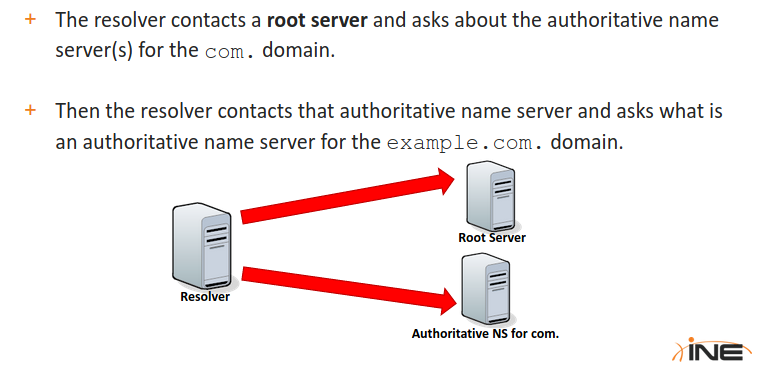

- IP addresses of the root servers are hardcoded in the configuration of the resolver

## 2.7.4 Reverse DNS Resolution

- The Domain name system can also perform the inverse operation, it can convert IP addresses to a DNS name
- The administrator of a domain must have enabled and configured this feature for the domain to make it work

* * *

* * *

# Wireshark

## 2.8.1 NIC Promiscuous Mode

- During Normal mode, a network card discards any packet addressed to another NIC
- In Promiscuous (monitor) mode, a network card will accept any packet it receives
- With the introduction of switched networks, sniffing other machines ethernet traffic got harder, you have to perform an attack such as ARP poisoning or MAC flooding in order to do that
- Wifi medium, (THE AIR), is broadcast by nature