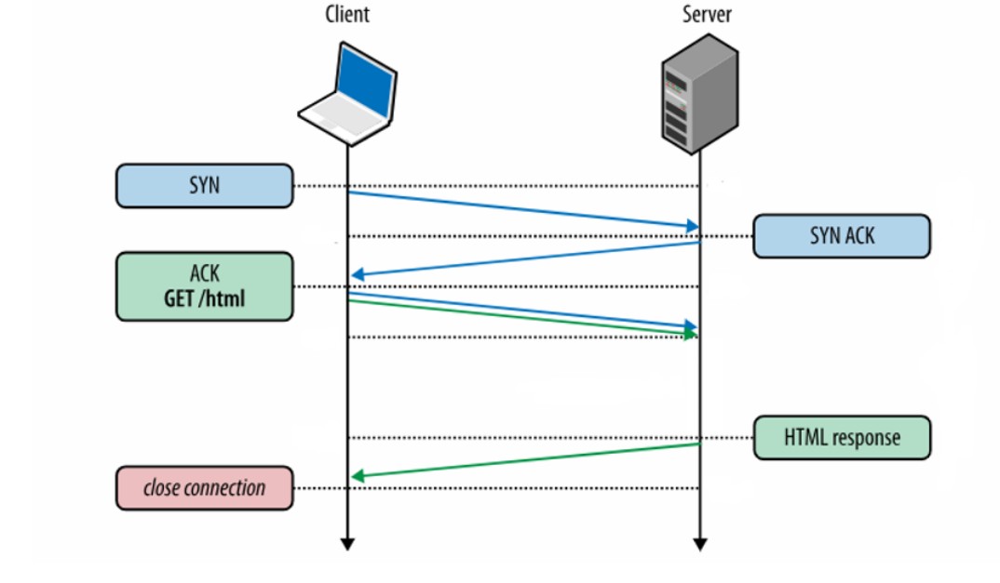
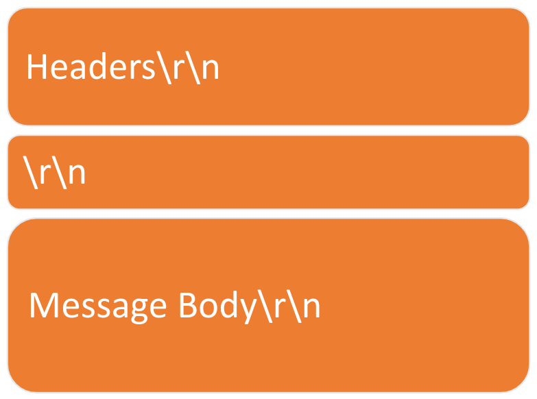
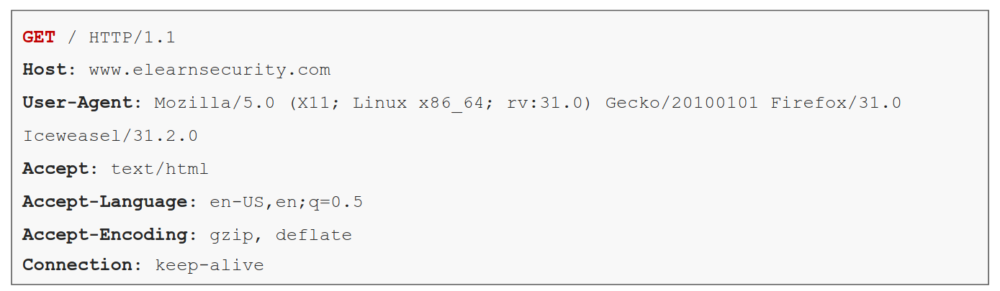
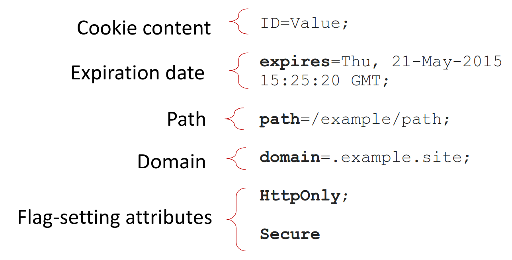
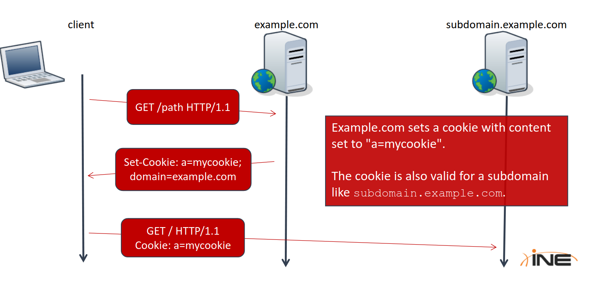
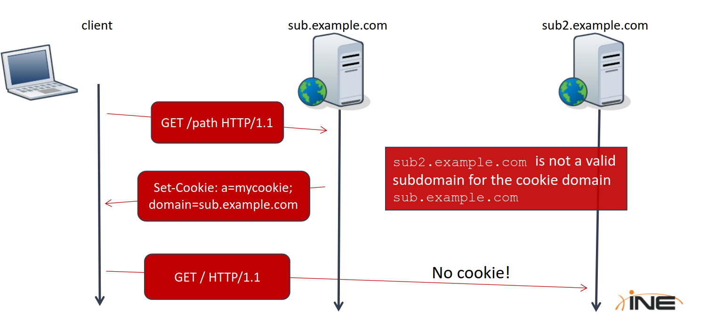
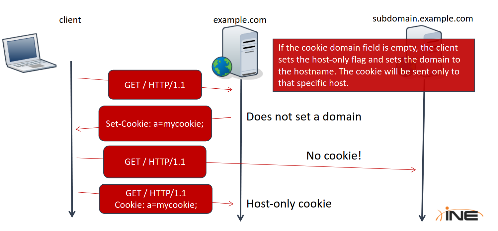

# HTTP Protocol Basics

## 3.2 HTTP Protocol Basics

- During an HTTP communication, the client (web browser...) and the server (apache...) exchange messages
- The client sends **requests** and the server reply by a **responses**
- HTTP works on top of TCP
- That measn, first a TCP connection is established



- The format of HTTP message is:



- In HTTP:
    - `\r` = carriage return
    - `\n` = newline

## 3.2.1 HTTP Requests



- **`GET`** is the **HTTP verb** of the request
- The HTTP verb states the type of the request
- **`GET`** is used when opening web resources
- After the HTTP verb, you can see the **Path** (`/`) and the **Protocol Version** (`HTTP/1.1`)
- The Path tells the server which resource the browser is asking for
- The protocol version tells the server how to communicate with the browser
- There are many HTTP methods:
    - `PUT`
    - `TRACE`
    - `HEAD`
    - `POST`
    - ... and much more
- The **Host** header section tells specifies the Internet Hostname and port number of the resource being requested
- **User Agent** field tells the server about the client software requesting, and the Operating System
- The browser sends the **Accept** header field to specify which document type it is expecting in the response from the server
- **Accept-Language** like Accept, but for human languages
- **Accept-Encoding** like Accept, but restricts the content encoding, not the content itself
- **Connection** header field allows the sender to specify options that are desired for that particular connection, future communications with the server will reuse the current connection

## 3.2.2 HTTP Responses

- When the server receives an HTTP Request, it processes it and sends back an HTTP Response to the client, the response has it's own header format:


- The header and message body are seperated by two empty lines (`\r\n\r\n`)
- The first line of the response message is the **Status-Line**, it consists of the protocol version, a numeric status code (200) and its relative textual meaning (OK)
- The most common **status codes** are:
    - **200 OK**: the resource was found
    - **301 Moved Permenantly**: The requested resource has been assigned a new permenent URI
    - **302 Found**: The resource is temporary under another URI
    - **403 Forbidden**: the client does not have enough privileges and the server refuses to fulfill the request
    - **404 Not Found**: The server cannot find a resource matching the request
    - **500 Internal Server Error**: The server doesn't support the functionality required to fulfill the request
- **Date** represents the date and time at which the message was generated
- With the **Cache-Control** header the server informs the client about cached content, using cache saves bandwidth as it prevents the client from re-requesting unmodified content
- **Content-Type**: lets the client know how to interpret the body of the message
- **Content-Encoding**: extends Contetn-Type, per example, message body compressed with gzip
- **Server** header field contains the header of the server that generated the content. It is optional and is very useful during a pentest to identify the software running on a server
- **Content-Length**: indicates the length in bytes, of the body message

## 3.2.3 HTTPS

- HTTP is a clear-text protocol, and does not provide strong authentication between the parties
- The **SSL/TLS** cryptographic protocol provides confidentiality, integrity protection and authentication to the HTTP protocol
- When inspecting HTTPS, one cannot know what domain is contacted and what data is exchanged
- A network adjacent user might recognize:
    - Target IP address
    - Target Port
    - DNS or similar protocols may disclose which domain user tries to resolve

* * *

* * *

# HTTP Cookies

## 3.3 HTTP Cookies

- HTTP is a stateless protocol
- Sessions and cookies were invented in 1994 by **Netscape**
- Cookies are textual information stored by the browser into "Cookies Jar"
- a server can set a cookie via the "**Set-Cookie**" HTTP header field in the response message
- a cookie contains the following attributes:
    - The actual content
    - an expiration date
    - a path
    - the domain
    - optional flags:
        - only HTTP flag
        - Secure flag

## 3.3.1 Cookies Format



## 3.3.3 Cookie Domain

- The **domain** field and the **path** field set the scope of the cookie
- When a web server installs a cookie, it sets the domain field, then the browser will use the cookie for every request sent to that domain and all its subdomains

## 3.3.3.1 Examples

 

## 3.3.4 Cookie Path

- The browser will send a cookie to the right **domain** and to any subpath of the **path** field value
- When a cookie has the path attribute set to: **path**=/the/path, the browser will send the cookie to the right domain and to the resources in:
    - /the/path
    - /the/path/sub
    - /the/path/sub/sub/sub/path
- but it will now send it to: /otherpath

## 3.3.5 Cookie Expire Attribute

- The **expires** attribute sets the **validity time window** of a cookie
- a browser will not send an expired cookie to the server

## 3.3.6 Cookie http-only Attribute

- When a server install a cookie into a client with **http-only**, the client will set the **http-only** flag for that cookie, this mechanism prevents Javascript, Flash, Java or any other non-HTML technology from reading the cookie, thus preventing cookie stealing via XSS

## 3.3.7 Cookie secure flag

- **Secure Flag** creates secure cookies that will only be sent over an HTTP**S** connection (NOT HTTP)

## 3.3.9 Cookie Protocol

- Cookies are often installed during a login
- In the example following, the browser sends a **POST** request with the username and password


- The server sends a response with **Set-cookie** header field, telling the browser to install the cookie


- For every subsequent request the browser considers: Domain, Path, Expiration, Flags. If all checks pass, the browser will insert a **cookie:** header in the request.


* * *

* * *

# Sessions

## 3.4 Sessions

- **Sessions** are mechanism that lets the website store available variable specific for a given visit on the **server side**
- Each user session is identified by a **session id**, or token, which the server assigns to the client
- The client then presents this ID for each subsequent request, thus being recognized by the server

## 3.4.1 Sessions Example


## 3.4.2 Session Cookies

- A web application installs session IDs on a web browser by using session cookies
- Session Cookies just contain a single parameter value pair referring to the session:

```
SESSION=0wvCtOBWDH8w
PHPSESSID=13Kn5z6Uo4pH
JSESSIONID=W7DPUBgh7kTM
```

- Websites running PHP install session cookies by using `PHPSESSID` parameter name
- JSP websites use `JSESSIONID`
- Each development language has its own default session parameter name
- The web developer can choose to use custom parameter name

## 3.4.2.1 Session Cookies Example

 

## 3.4.3 GET Requests

- Session IDscan also be transmitted via **GET requests**:

`http://example.site/resource.php?sessid=k27rjvgdw`

* * *

* * *

# Same Origin Policy

## 3.5 Same Origin Policy

- Same origin policy (SOP) prevents JavaScript code from getting or setting properties on a resource coming from a different origin
- To determine if JavaScript can access a resource: **Hostname, port and protocol** must match

**Example**

- A JavaScript on `https://www.0l0v3r1.com:345/` can read resources from:
    - `https://www.0l0v3r1.com:345/path`
    - `https://www.0l0v3r1.com:345/path/2`
- But not from:
    - `https://www.0l0v3r1.com/path` \- different port
    - `http://www.0l0v3r1.com:345/path` \- different protocol
    - `https://www.example.com/345/path` \- different domain

* * *

* * *

# Burp Suite

## 3.6.1 Inercepting Proxies

- The most used web application proxies are:
    - The intercepting proxy feature of Burp suite
    - ZAP (It worked perfectly and has a very good spider)

* * *

* * *