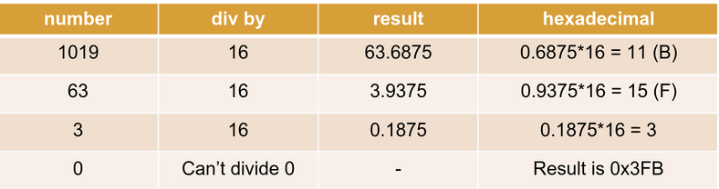

# The Information Security Field

## 1.1 - Infosec Culture

- The Term ***hacker*** was born in the sixties in the MIT community.

* * *

* * *

# Binary Arithmetic Basics

## 1.4.2 - Converting from and to Binary

**To convert a decimal no into binary:**

- Divide it by 2 and save the reminder (0 or 1)
- Then do it again dividing the result of the previous operation and saving the reminder (0 or 1)
- Iterate until the divident is 0

## 1.4.3 Bitwise Operations

- **NOT**: simple operation that flips the bits.

```
NOT 1101 = 0010
```

- **AND**: performs a *logical AND* between the bits.

```
1001 AND 1100 = 1000
```

- **OR**: performs a *logical OR* between the bits.

```
1001 OR 1100 = 1101
```

- **XOR**: performs a *logical exclusive OR* between the bits.

```
1001 OR 1100 = 1101
```

## 1.4.5 Hexadecimal Arithemtic

- To inform that the given number is *Hexadecimal* we use `0x` at the beginning or `h` at the end.
- The target number's decimal representation: `3a1h` becomes `(3 10 1)h`
- To convert from Hexacdecimal to decimal, we use the position of the digits:
    - `0x3a1 = 0x(3 10 1)`
    - `0x3a1 = 1*16^0 + 10*16^1 + 3*16^2 = 929`


- To convert from decimal to Hexadecimal we performe subsequent divisions by 16 and note down the reminders as below:



* * *

* * *