# C++ IDE


## 2.1 C++ IDE

* They used **Dev-C++ IDE** for the cource, me, I will be using **Code::Blocks IDE** because it is **BETTER**

***
***

# Structure of C++ Programs

## 2.2 Structure of C++ Programs

* A line starting with `#` are directives
```cpp
#include <iostream>
```

* In the following example, it instructs the compiler to include the code of the `iostream` library in our program.
* `iostream` is a library that provides input and output functionalities
```cpp
#include <iostream>
using namespace std;
int main ()
{
	cout << "Hello World!";
	return 0;
}
```

* `namespaces` are used to group a set of classes, functions, etc. under a name
* Since all the elements in the standart C++ library (such `iostream`) are declared within the `std namespace`, we need this command to access its functionalities
* `;` is called **terminator**
* The **main** function is where our program execiton starts
* `cout` is the name of the standard output. Most of the time, it is the console
* The `cout <<` statement tells the compiler to put a sequence of characters onto the standard output stream (the console)
* `return 0` causes the main function to end. It can have different values as we will see

***
***

# Variables and Types

## 2.3 Variables and Types

* Variables are portions of memory where values are stored
* There are many data types we can use:
	* Short Integer: `short` or `short int` = 2 bytes
	* Integer: `int` = 4 bytes
	* Long Integer: `long` or `long int` = 4 bytes
	* Boolean: `bool` = 1 byte
	* Floating point number: `float` = 4 bytes
	* Double precision floating point number: `double`  = 8 bytes
	* Character: `char` = 1 byte
* Variables can be **Global** or **Local**
	* Global variables: are declared in the body of the source code (not in a function)
	* Local variables: are declared inside a function body or block enclosed in `{}` and  Their scope is limited to the block they are declared

***
***

# Input / Output

## 2.4 Input / Output

```cpp
cout << "The value of variable sum is: " << sum << endl;
```

* The `cout` statement represents the standard output
* The `<<` operator tells the program to insert the next data into the stream
* `endl` inserts a 'new line character' and flushes the buffer. This ensures that the next output prints in the next line.
* We can use the `cin` function followed by the operator `>>` in order to get the user input. In this case the standard input is the keyboard


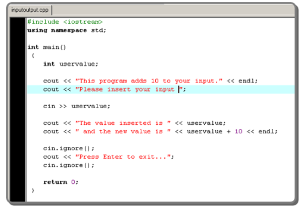

* With `cin >> uservalue;` statement, we instruct the program to get the input from the standard input (keyboard) and save it in the `uservalue` variable
* When we run the program, in order to keep the console opened, we need to clean this buffer with the first `cin.ignore()` statement and then with the second `cin.ignore()` we can prevent the console from closing
* In other words, the first `cin.ignore()` reads the return value and the second one waits for a new input keeping the console on the screen


***
***

# Operators

## 2.5 Operators

* In C++ there are 4 main classes for operators:
	* Arithmetic
	* Relational
	* Logical
	* Bitwise

**`variable_name = expression;`**
* The assignment operator can be used within any valid expression. The left part (Target) must be a variable or a pointer and can't be constant or function
* In C++, we will see two terms: **lvalue** and **rvalue**.
* **lvalue:** is any label that appears on the left side of an assignment statement, in other words: the variable name
* **rvalue:** refers to the expression/value on the right side of the assignment and means the value that will be assigned to the variable
* **Arithmetic Operators:**


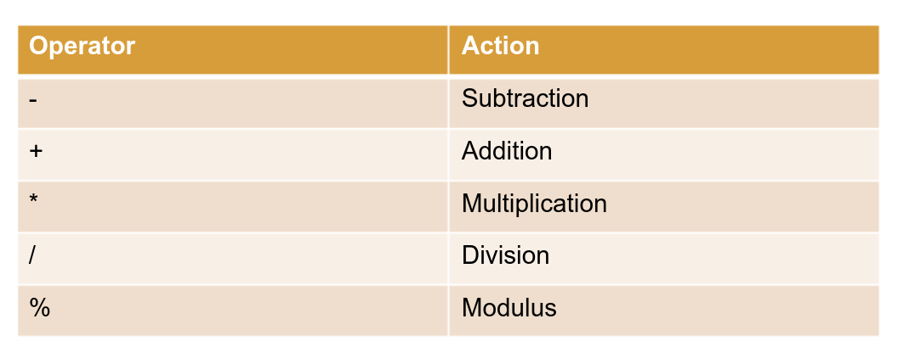

* `++x`: the increment operation is performed before obtaining the value of the operand
* `x++`: the value is obtained before incrementing it


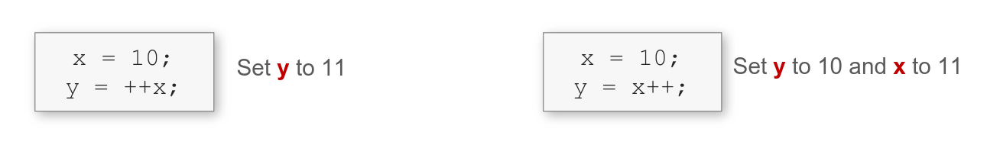

* **Relational Operators:**


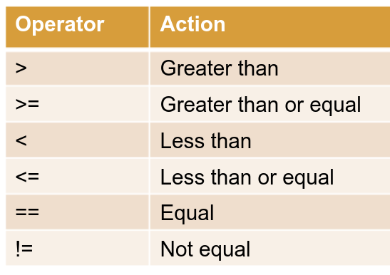

* **Logical Operators:**


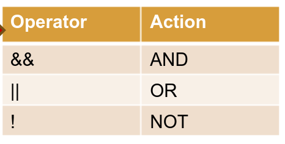

* The result of a **relational operator** is Boolean value

* **Bitwise Operators:**
	* Bitwise operators refer to testing, setting or shifting the actual bits in a byte or a word

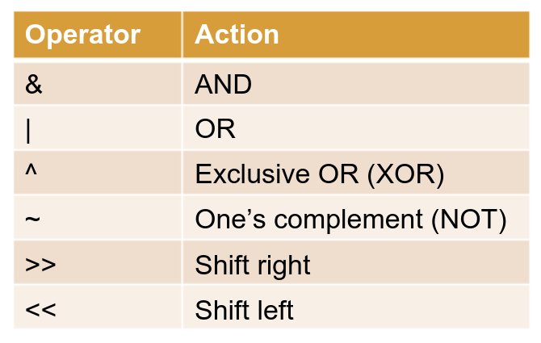

**EXAMPLE:**


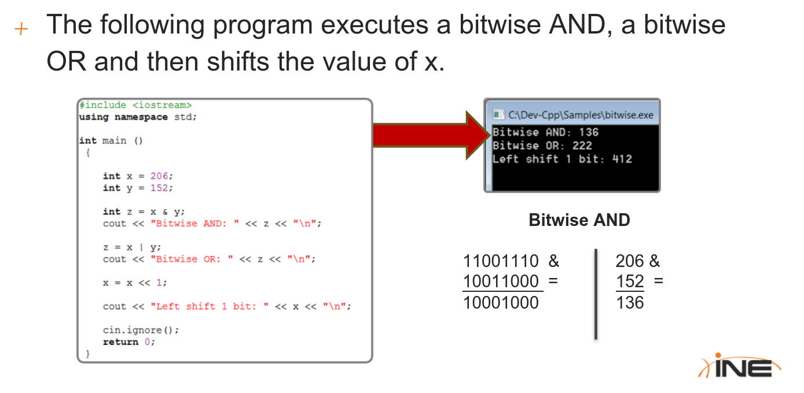

***
***

# Iteration and Conditional Structures

## 2.6 Iteration and Conditional Structures

* The general form of the `if` statement:

```cpp
if (expression)
	statement;
else
	statement;
```

* A multiple-branch selection statement `switch`:

```cpp
switch (expression){
	case constant1:
		statement sequence
		break;
	case constant2:
		statement sequence
		break;
	.
	.
	.
	default
		statement sequence
}
```

* The general for of a `for` statement is:

```cpp
for(initialization;condition;increment){
	statement;
}
```
* Where:
	* **initialization:** is an assignment statement that sets the starting value of the loop control variable
	* **condition:** determines when the loop must end
	* **increment:** defines how the control variable changes for each iteration

**Example:**

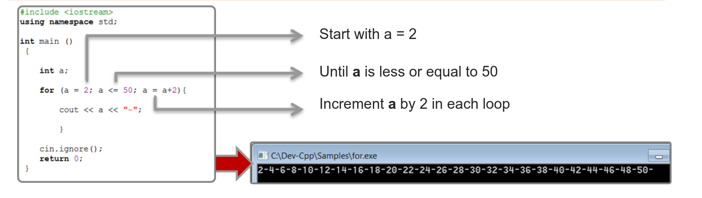

* An infinite loop used with a `break` statement can be useful to keep the console alive until the user choose to exit:


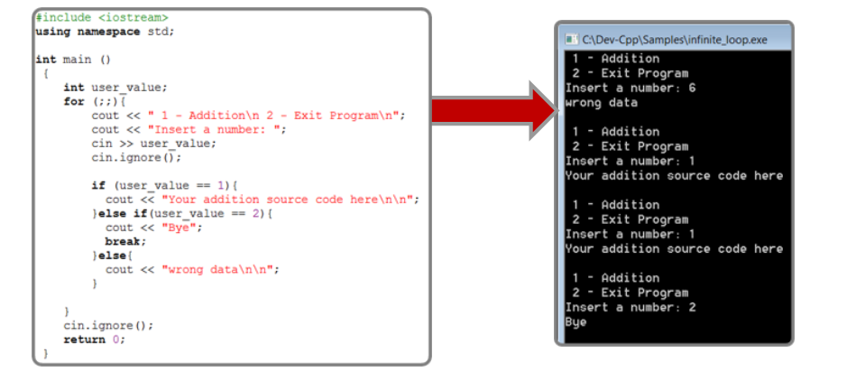

* The general for of a `while` loop is:

```cpp
while(condition)	{
	statement;
}
```

* The general for of a `do-while` loop is:
```cpp
do {
	statement;
}while(condition);
```

* `do-while` loops check the condition at the end of the loop
* My code for the Triangle Tree:

```cpp
#include <iostream>
/*

*
   ***
  *****
 *******
*********

*/

using namespace std;
int main ()
{
	int lines,line;
	char star = '*';
	char space = ' ';
	cout << "Please enter the number of lines" << endl;
	cin >> lines;
	cin.ignore();

	for(line=1; line<=lines; line++)
	{
        cout << string((lines-line), space);
        cout << string(line*2-1, star) << endl;
	}

}

```

* Statements that can can change the normal execution flow:
	* **return**
	* **goto**
	* **break**
	* **continue**
* `break` and `continue` are often used in conjuction with any loop statements while `return` and 	`goto` are mostly used anywhere in the code
* The function stops executing as soon as it encouters the first `return`
* `goto` is used to jump to a specific statement, `goto` requires a label, an identifier followed by `:` = `label:`
* The label must be in the same block as the goto, we cannot jump between functions
* `break` statement has two uses:
	* Terminate a case in the switch statement
	* Forces the termination of a loop bypassing the normal loop conditional test
* `continue` statement forces the code to continue to the next iteration of a loop skipping any code in between, so in a for loop, `continue` causes an increment of the control variable and a new iteration

***
***

# Pointers

## 2.7 Pointers

* A pointer is a variable that holds a memory address, this address is the location of another object in memory
* For example, if a variable (a) contains the address of another variable (b), (a) is said to point to (b)


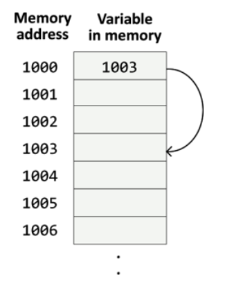

* If the variable is a pointer, to declare it we will write `*` and the variable name:
	* `type *name;`
* There are two special operators: `*` and `&`:
	* `&` = returns the memory address of the variable
	* `*` = returns the value located at the address given

**Example:**


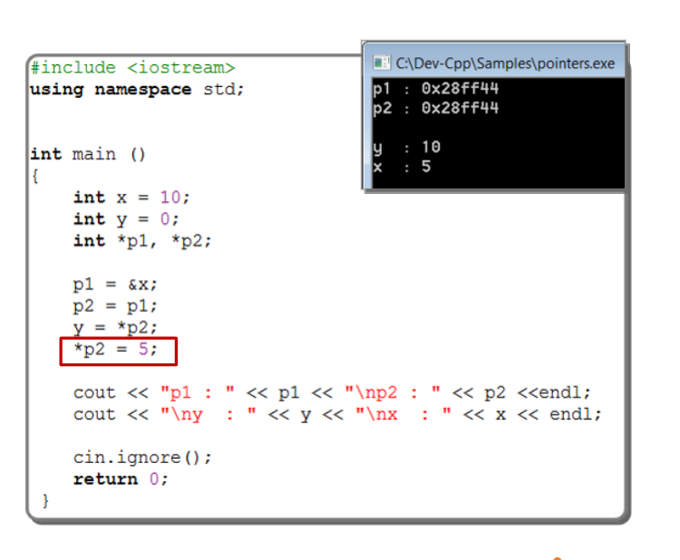

***
***
# Arrays

## 2.8 Arrays

I know what arrays are!

***
***

# Functions

## 2.9 Functions

* The general form of functions:
```cpp
type function_name(parameter1, parameter2, ...){
	statements;
}
```

* In all Programming languages there are two ways of passing arguments to a function:
	* **By value**: copies the value of an argument into a parameter, changes made to the parameter do not affect the argument. What occurs inside the function has NO EFFECT on the variable provided by the caller
	* **By Reference**: the address of the argument (not the value) is copied into the parameter. Inside the function, the address is used to access the actual argument used in the call so changes made to the parameter affect the argument